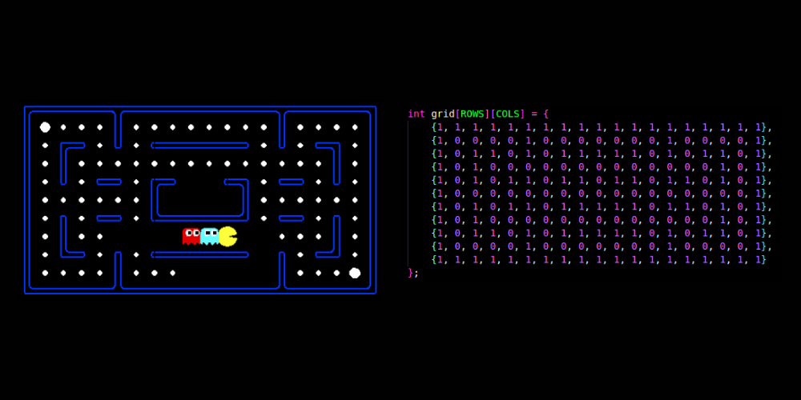
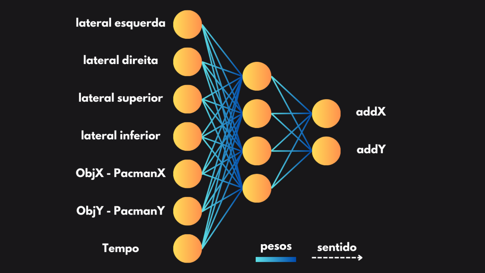
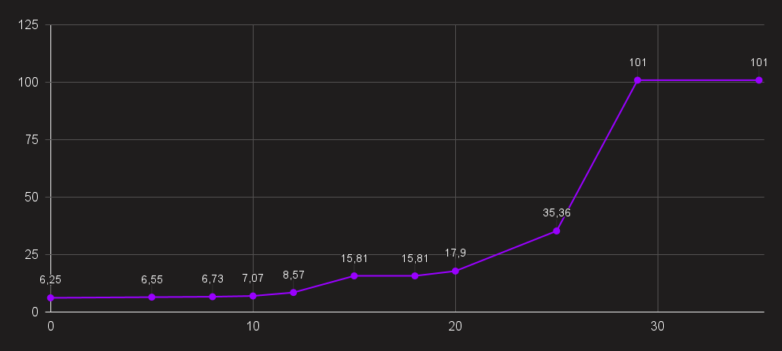

# Algoritmo Evolutivo - Pacman

Projeto da disciplina de Sistemas Evolutivos

Este projeto tem como objetivo aplicar um algoritmo evolutivo no Pacman, cujo principal desafio é fugir de fantasmas enquanto se move por um mapa. O Pacman utiliza um algoritmo evolutivo para evoluir suas estratégias de forma progressiva, aprimorando seu comportamento ao longo das gerações.

O objetivo do algoritmo é fazer com que o Pacman chegue a um ponto específico do mapa, evitando ser pego por quatro fantasmas que estão espalhados pelo labirinto.

A seguir, explicarei os principais pontos do projeto:

## Mapa

O mapa do projeto foi inspirado em uma das versões clássicas do jogo Pacman. Ele foi implementado no código utilizando uma matriz bidimensional (COLS 19 x ROWS 11), onde cada elemento pode ser 0 ou 1. Nessa matriz, o valor 0 representa as paredes (áreas que o Pacman e os fantasmas não podem atravessar) e o valor 1 representa os corredores (áreas livres onde os personagens podem se mover).

Abaixo está uma representação visual do mapa utilizado, que se baseia em uma versão do jogo original:

No projeto, o arquivo que contém o mapa não apenas define a matriz que representa o labirinto, mas também imprime o estado do jogo em tempo real, mostrando os passos do Pacman e dos fantasmas. Além disso, o arquivo exibe colisões com as paredes (representadas pela letra "X") e interrompe o jogo caso o Pacman seja capturado por um fantasma (ou seja, quando o Pacman e um fantasma ocupam o mesmo espaço no mapa).

### Feromônios

O projeto inclui um sistema de feromônios, representados em uma matriz auxiliar, que o Pacman deixa para trás enquanto se move pelo mapa. Essa matriz é utilizada pelos fantasmas para rastrear os movimentos do Pacman, permitindo que eles sigam um caminho mais eficiente em direção ao Pacman.

Inicialmente, os fantasmas possuem uma vantagem, já que podem rastrear os feromônios deixados pelo Pacman. No entanto, com o passar das gerações, o Pacman evolui e se torna mais inteligente, superando a vantagem dos fantasmas e aprendendo a evitar os rastros deixados no mapa.

## Fantasmas

No código dos fantasmas, a função mais relevante a ser discutida é a função de movimentação dos fantasmas, chamada moveFantasma. Os fantasmas seguem três tipos de movimentação, dependendo da posição em que se encontram, de forma hierárquica:

### Seguindo o rastro de feromônios deixado pelo Pacman

Os fantasmas utilizam os rastros de feromônios deixados pelo Pacman para localizá-lo. Eles irão se mover para o local que contém o feromônio mais forte. Por exemplo, se o fantasma está em uma posição onde há um feromônio com valor 5 à sua frente, um valor 4 à sua esquerda e um valor 6 à sua direita, o fantasma irá seguir para a direita, onde o valor do feromônio é maior. O valor dos feromônios é definido de acordo com o tempo em que o Pacman passou por um determinado ponto, ou seja, quanto maior o valor do feromônio, mais recentemente o Pacman passou por aquele local. A definição exata dos feromônios será explicada mais à frente na seção Pacman.

### Usando sua própria visão

Caso não haja nenhum feromônio detectado, o fantasma analisa suas quatro direções ortogonais (cima, baixo, esquerda, direita) em busca do Pacman. Se o Pacman estiver visível em uma dessas direções, o fantasma irá em direção a ele. Importante ressaltar que o fantasma não pode "ver" através das paredes. Ou seja, se houver uma parede bloqueando sua visão e o Pacman estiver atrás dessa parede, o fantasma não será capaz de detectá-lo. A mecânica de visão do fantasma é similar à visão humana: ele não sabe o que está atrás de um obstáculo.

### Sorteando a direção

Caso as opções anteriores falhem (ou seja, se não houver feromônios e o Pacman não estiver visível), o fantasma irá escolher aleatoriamente uma direção para seguir até que ele possa voltar a utilizar a primeira ou a segunda opção para localizá-lo.

## Pacman

O código do Pacman é mais complexo do que o dos fantasmas, pois é nele que ocorre a aplicação da seleção genética para gerar a próxima geração. A função de destaque do Pacman é a função movePacman, que funciona da seguinte maneira:

### Contador de tempo/passos

Dentro da função movePacman, há um contador que registra o tempo ou os passos do Pacman. Esse contador é utilizado para estabelecer um limite de tempo, além de ser crucial para a grade de feromônios fornecida aos fantasmas. Por exemplo, no tempo 5, será marcado o valor 5 na grade de feromônios, e no tempo 6 será marcado o valor 6, independentemente da direção que o Pacman escolher seguir. Isso cria uma trilha de feromônios que os fantasmas podem seguir.

### Visão do Pacman

Em seguida, é calculada uma variável chamada visão, que considera os blocos laterais ao Pacman (não é uma visão ampla como a dos fantasmas, mas uma visão limitada às posições adjacentes ao Pacman). Com isso, o Pacman obtém 4 números (um para cada direção: cima, baixo, esquerda, direita).

### Cálculo da diferença para o objetivo

Depois, calcula-se a diferença entre a posição atual do Pacman (no eixo x) e o x do objetivo (o mesmo processo é feito para o eixo y). Isso gera mais 2 números, totalizando 6 números até esse ponto.

### Entrada para a rede neural

Os 6 números anteriores, somados ao tempo total do jogo (gerando um total de 7 números), são enviados para a rede neural do Pacman. A rede possui 7 neurônios de entrada e retorna 2 valores (dois neurônios de saída). Esses dois valores são dx e dy, que determinam como o Pacman irá se mover.

### Filtragem de movimento:
        
A filtragem do movimento é feita seguindo os seguintes passos:

1. Comparação entre os módulos de dx e dy: O módulo maior (valor absoluto) de dx ou dy determina o eixo em que o Pacman irá se mover.

2. Verificação dos sinais: Depois de determinar o eixo, é verificado o sinal (positivo ou negativo) dos valores de dx e dy. Se o valor de dx for maior e negativo, o Pacman irá se mover uma posição à esquerda (-1). Se for positivo, o Pacman se moverá uma posição à direita (+1). O mesmo raciocínio é aplicado para o eixo y (cima ou baixo).

### Atualização da grade de feromônios

Após o movimento, a posição do Pacman é registrada na grade de feromônios, criando uma trilha para os fantasmas.

Dentro do código do Pacman, também é importante destacar duas funções chamadas crossover e mutação, que são utilizadas pelo algoritmo genético para criar novas gerações. Esses conceitos serão explicados a seguir.

## Algoritmo Genetico

O algoritmo genético (AG) é utilizado para selecionar os melhores indivíduos de uma população, com o objetivo de criar uma nova geração com um desempenho superior, ou seja, com valores de fitness melhores do que os da geração anterior.

Após avaliar a população, com base na distância de cada indivíduo em relação ao objetivo desejado, os 5 melhores indivíduos são selecionados. A partir desses indivíduos, uma nova população é gerada utilizando os operadores de crossover e mutação, que ocorrem de forma aleatória.

Um ponto crucial a ser destacado é que o AG seleciona os melhores pesos, que são os valores atribuídos às conexões entre os neurônios de uma rede neural. Esses pesos têm um papel fundamental no desempenho final da rede. Para que o resultado seja satisfatório, os pesos precisam ser adequados, e é exatamente isso que o AG faz: ele seleciona e aprimora os melhores pesos, garantindo assim a evolução para uma solução mais eficaz.

## Análise das Saídas

A seguir está o gráfico de uma saída (saída média) dos resultados do projeto e sua evolução ao decorrer das gerações:

## Vídeo sobre o projeto

[link do vídeo no Youtube](https://youtu.be/bWFl-Bnv-as).

## Agradecimentos

Agradeço ao excelentíssimo professor Eduardo do Valle Simões, vulgo [Simões Poderoso :robot:](https://gitlab.com/simoesusp), que me auxiliou na execução desse projeto e ao meu veterano "[Bom Dia :sun_with_face:](https://github.com/mpferreira003)" que me ajudou à finalizá-lo.

## Alunos

- Camila Piscioneri Magalhães ([Dr. Verdin :seedling:](https://github.com/Dr-Verdin)).